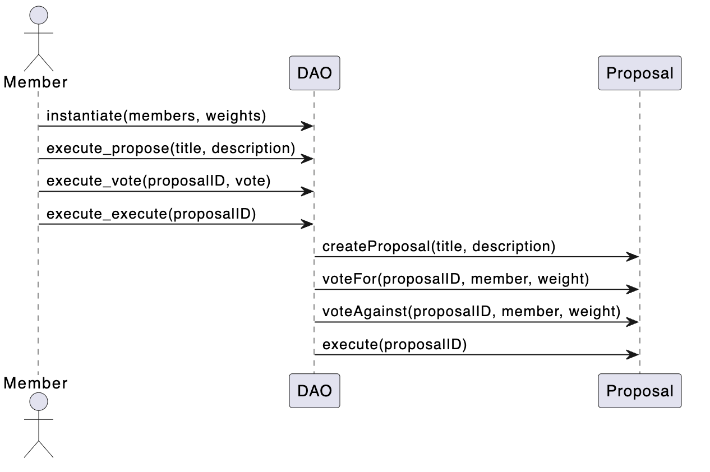

# Grant Dao

The Coreum Grant Dao is designed for decentralized grant management using the Cosmos SDK and the cosmwasm platform. This DAO allows members to propose, vote on, and execute grant proposals based on their voting weight.



## Table of Contents

- [Features](#features)
- [Installation](#installation)
- [Usage](#usage)
  - [Instantiation](#instantiation)
  - [Proposing a Grant](#proposing-a-grant)
  - [Voting on a Proposal](#voting-on-a-proposal)
  - [Executing a Proposal](#executing-a-proposal)
  - [Querying the DAO](#querying-the-dao)
- [State Structures](#state-structures)
- [Contribution](#contribution)
- [License](#license)

## Features

1. **Proposal Management**: Members can propose new grants with a title and detailed description.
2. **Weighted Voting**: Each member has a weight that influences the outcome of the votes.
3. **Proposal Execution**: Approved proposals can be executed.
4. **Query System**: Fetch specific proposals, list all proposals, or retrieve member details.

## Makefile Commands

The project includes a Makefile that provides a collection of useful commands to streamline the development, testing, and deployment process for the "Coreum Grant Dao" smart contract. Below is a detailed overview of these commands:

### Prerequisites

The Makefile uses several predefined variables for configuration:

- **Coreum Configuration**:
  - `COREUM_CHAIN_ID`: Chain ID for the Coreum network.
  - `COREUM_DENOM`: Token denomination for the Coreum network.
  - `COREUM_NODE`: Node URL for the Coreum network.
  - `COREUM_VERSION`: Version of the Coreum binary.
  - `COREUM_HOME`: Local directory for Coreum data.
  - `COREUM_BINARY_NAME`: Name of the Coreum binary based on the architecture.

- **Development Configuration**:
  - `DEV_WALLET`: Name of the development wallet.
  - `CODE_ID`: ID of the stored wasm code (update after storing the contract).
  - `SUBUNIT`: Subunit of the token (for smaller denominations).
  - `CONTRACT_ADDRESS`: Address of the deployed contract (update after instantiation).
  - `WALLET_ADDRESS`: Address of the developer's wallet.

### Commands

- **dev**:
  - Print the current working directory.
  - Print the basename of the current directory.
  - Build the Rust project.

  ```bash
  make dev
  ```

- **test**:
  - Run Rust tests without capturing the output.

  ```bash
  make test
  ```

- **add_account**:
  - Recover and add a development wallet.

  ```bash
  make add_account
  ```

- **build**:
  - Use the `cosmwasm/rust-optimizer` Docker image to optimize the Rust contract.

  ```bash
  make build
  ```

- **deploy**:
  - Store the compiled wasm contract on the Coreum network and print the code ID.

  ```bash
  make deploy
  ```

- **check**:
  - Query information about the stored wasm code.

  ```bash
  make check
  ```

- **keys**:
  - List all keys in the cored wallet.

  ```bash
  make keys
  ```

- **q**:
  - Query the balance of the developer's wallet.

  ```bash
  make q
  ```

- **fund**:
  - Send tokens to the developer's wallet from the `alice` account.

  ```bash
  make fund
  ```

- **instantiate**:
  - Instantiate the stored wasm contract with initial data.

  ```bash
  make instantiate
  ```

- **contract_address**:
  - Query and print the address of the instantiated contract.

  ```bash
  make contract_address
  ```

- **propose**:
  - Submit a new proposal

  ```bash
  make propose
  ```

- **vote**:
  - Cast vote for a proposal

  ```bash
  make vote
  ```

- **execute**:
  - Execute the proposal after voting

  ```bash
  make execute
  ```


## Usage

### Instantiation

To instantiate the DAO, you need to provide an initial list of members along with their weights.

```rust
pub struct InstantiateMsg {
    pub members: Vec<MemberInit>,
}
```

### Proposing a Grant

Members can propose new grants using the `Propose` variant of the `ExecuteMsg` enum.

```rust
pub enum ExecuteMsg {
    Propose {
        title: String,
        description: String,
    },
    ...
}
```

### Voting on a Proposal

Members can vote on proposals based on their weight.

```rust
pub enum ExecuteMsg {
    ...
    Vote {
        proposal_id: u64,
        approve: bool,
    },
    ...
}
```

### Executing a Proposal

Once a proposal meets the required approval threshold, it can be executed.

```rust
pub enum ExecuteMsg {
    ...
    Execute {
        proposal_id: u64,
    },
}
```

### Querying the DAO

The contract supports various query operations.

```rust
pub enum QueryMsg {
    GetProposal {
        proposal_id: u64,
    },
    ListProposals {},
    GetMember {
        address: Addr,
    },
    ...
}
```

## State Structures

The contract maintains state regarding proposals and members.

```rust
pub struct Proposal {
    pub id: u64,
    pub title: String,
    pub description: String,
    pub recipient: Addr,
    pub amount: Uint128,
    pub votes_for: Uint128,
    pub votes_against: Uint128,
    pub executed: bool,
}

pub struct Member {
    pub address: Addr,
    pub weight: Uint128,
}
```
